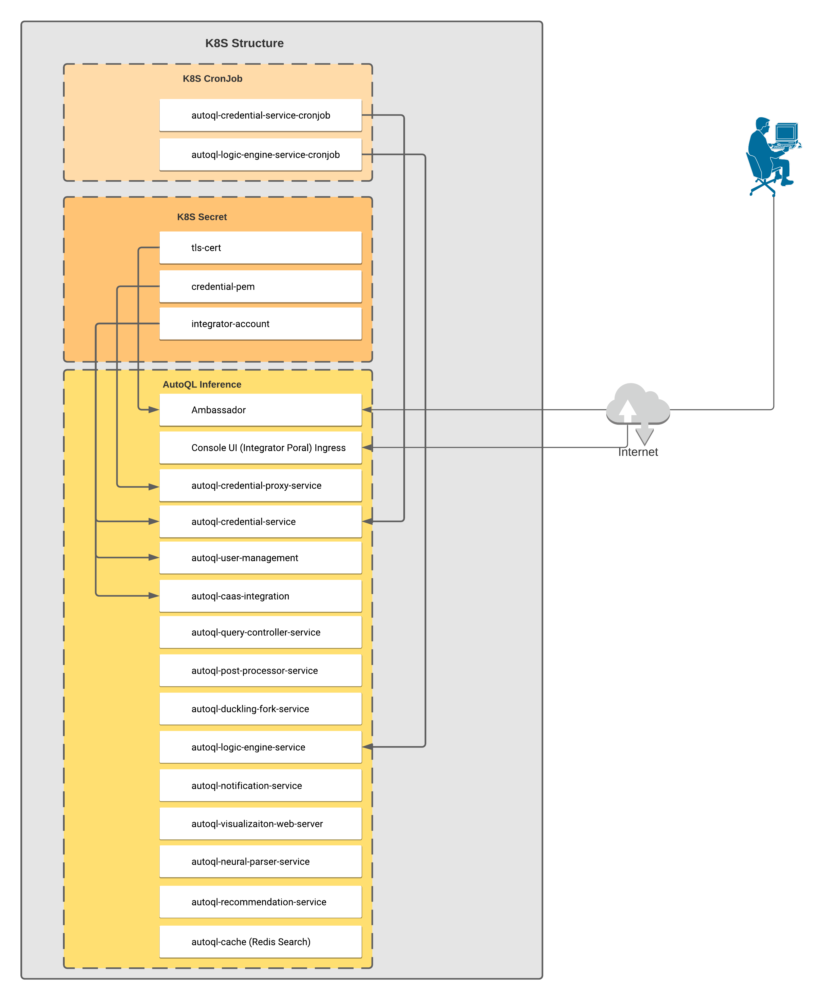

# dql-marketplace-app

# Overview

Deployable AutoQL solution by Chata is an open source platform to accelerate data-driven decision-making and eliminate repetitive reporting tasks. With AutoQL empower your non-technical users to access real-time data with ease, increase productivity and reduce the demand on the technical team – all while ensuring the highest data security.

## About Google Click to Deploy

Popular open stacks on Kubernetes packaged by Google.

## Architecture

This application is a deployment of a stateful, deployable vm installation on a Kubernetes cluster and then installing the AutoQL services from the deployable VM.



# Installation

## Quick install with Google Cloud Marketplace

Get up and running with a few clicks! Install this Deployable AutoQL solution by Chata app to a Google
Kubernetes Engine cluster using Google Cloud Marketplace. Follow the
[on-screen instructions](<Link yet to be published>).

## Command line instructions

You can use [Google Cloud Shell](https://cloud.google.com/shell/) or a local
workstation to complete these steps.

[](https://console.cloud.google.com/cloudshell/editor?cloudshell_git_repo=https://github.com/chatatechnologies/dql-marketplace-app&cloudshell_open_in_editor=README.md&cloudshell_working_dir=/)

### Prerequisites

#### Set up command-line tools

You'll need the following tools in your development environment. If you are
using Cloud Shell, `gcloud`, `kubectl`, Docker, and Git are installed in your
environment by default.

-   [gcloud](https://cloud.google.com/sdk/gcloud/)
-   [kubectl](https://kubernetes.io/docs/reference/kubectl/overview/)
-   [docker](https://docs.docker.com/install/)
-   [git](https://git-scm.com/book/en/v2/Getting-Started-Installing-Git)

Configure `gcloud` as a Docker credential helper:

```shell
gcloud auth configure-docker
```

#### Create a Google Kubernetes Engine cluster

Create a new cluster from the command line:

```shell
export CLUSTER=dql-cluster
export ZONE=us-east1-b

gcloud container clusters create "$CLUSTER" --zone "$ZONE"
```

Configure `kubectl` to connect to the new cluster:

```shell
gcloud container clusters get-credentials "$CLUSTER" --zone "$ZONE"
```

#### Clone this repo

Clone this repo and the associated tools repo.

```shell
git clone --recursive https://github.com/chatatechnologies/dql-marketplace-app.git
```

#### Install the Application resource definition

An Application resource is a collection of individual Kubernetes components,
such as Services, Deployments, and so on, that you can manage as a group.

To set up your cluster to understand Application resources, run the following
command:

```shell
kubectl apply -f "https://raw.githubusercontent.com/GoogleCloudPlatform/marketplace-k8s-app-tools/master/crd/app-crd.yaml"
```

You need to run this command once.

The Application resource is defined by the
[Kubernetes SIG-apps](https://github.com/kubernetes/community/tree/master/sig-apps)
community. The source code can be found on
[github.com/kubernetes-sigs/application](https://github.com/kubernetes-sigs/application).

### Install the Application

#### Create the namespace, configmap and secrets required for the Application

#### Create namespace in your Kubernetes cluster

If you use a different namespace than `default`, run the command below to create
a new namespace:

```shell
kubectl create namespace "$NAMESPACE"
```

#### Create the secrets and configmaps

Chata will provide you with a folder that has secert files and scripts to create the required secrets and configmaps. Follow the `Readme` provided with hem to set up the prerequisites.

Navigate to the `dql-marketplace-app` directory:

```shell
cd dql-marketplace-app
```

#### Configure the app with environment variables

Choose an instance name and
[namespace](https://kubernetes.io/docs/concepts/overview/working-with-objects/namespaces/)
for the app. In most cases, you can use the `default` namespace.

```shell
export INSTANCE_NAME=dql-marketplace
export NAMESPACE=$NAMESPACE
```

Configure the container images:

```shell
TAG=5.3
```

#### Configure the service account

For the deployable vm to be able to manipulate Kubernetes resources, there must be a
service account in the target namespace with cluster-wide permissions to
manipulate Kubernetes resources.

To provision a service account and export it via an environment variable, run the
following command:

```shell
export SERVICE_ACCOUNT="${INSTANCE_NAME}-sa"
```

To create service accounts, expand the manifest:

```shell
cat resources/service-account.yaml \
  | envsubst '${INSTANCE_NAME} \
              ${NAMESPACE} \
              ${SERVICE_ACCOUNT}' \
    > "${INSTANCE_NAME}_sa_manifest.yaml"
```

You can create the accounts on the cluster with `kubectl`:

```shell
kubectl apply -f "${INSTANCE_NAME}_sa_manifest.yaml" \
    --namespace "${NAMESPACE}"
```

By design, the removal of StatefulSets in Kubernetes does not remove
PersistentVolumeClaims that were attached to their Pods. This prevents your
installations from accidentally deleting stateful data.

To remove the PersistentVolumeClaim with their attached persistent disks, run
the following `kubectl` commands:

```shell
kubectl delete persistentvolumeclaims \
  --namespace ${NAMESPACE} \
  --selector app.kubernetes.io/name=${APP_INSTANCE_NAME}
```

### Delete the GKE cluster

Optionally, if you don't need the deployed application or the GKE cluster,
delete the cluster using this command:

```shell
gcloud container clusters delete "${CLUSTER}" --zone "${ZONE}"
```
