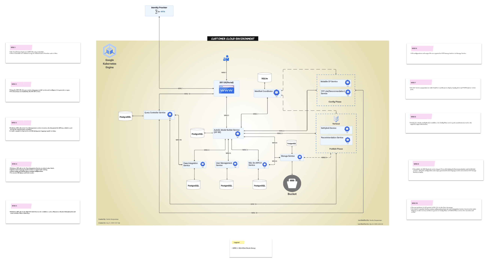

# Chata DQL Kubernetes Application for Google Cloud Marketplace

# Overview

Deployable AutoQL solution by Chata is a platform to accelerate data-driven decision-making and eliminate repetitive reporting tasks. With AutoQL empower your non-technical users to access real-time data with ease, increase productivity and reduce the demand on the technical team – all while ensuring the highest data security.

For more information, visit the [Chata website](https://chata.ai/).

## Architecture

This application is a deployment of a statefulset, deployable vm installation on a Kubernetes cluster and then installing the AutoQL services from the deployable VM.



# Installation

## Quick install with Google Cloud Marketplace

Get up and running with a few clicks! Install this Deployable AutoQL solution by Chata app to a Google Kubernetes Engine cluster using Google Cloud Marketplace. Follow the
[on-screen instructions](<Link yet to be published>).

## Command line instructions

You can use [Google Cloud Shell](https://cloud.google.com/shell/) or a local
workstation to complete these steps.

[](https://console.cloud.google.com/cloudshell/editor?cloudshell_git_repo=https://github.com/chatatechnologies/dql-marketplace-app&cloudshell_open_in_editor=README.md&cloudshell_working_dir=/)

### Prerequisites

#### Set up command-line tools

You'll need the following tools in your development environment. If you are
using Cloud Shell, `gcloud`, `kubectl`, Docker, and Git are installed in your
environment by default.

- [gcloud](https://cloud.google.com/sdk/gcloud/)
- [kubectl](https://kubernetes.io/docs/reference/kubectl/overview/)
- [docker](https://docs.docker.com/install/)
- [git](https://git-scm.com/book/en/v2/Getting-Started-Installing-Git)
- [helm](https://helm.sh/)
- [envsubst](https://command-not-found.com/envsubst)

Configure `gcloud` as a Docker credential helper:

```shell
gcloud auth configure-docker
```

#### Create a Google Kubernetes Engine (GKE) cluster

Create a new cluster from the command line:

```shell
export CLUSTER=dql-cluster
export ZONE=us-east1-b

gcloud container clusters create "$CLUSTER" --zone "$ZONE"
```

Configure `kubectl` to connect to the new cluster:

```shell
gcloud container clusters get-credentials "$CLUSTER" --zone "$ZONE"
```

#### Clone this repo

Clone this repository:

```shell
git clone --recursive https://github.com/chatatechnologies/dql-marketplace-app.git
```

#### Install the Application resource definition

An Application resource is a collection of individual Kubernetes components,
such as Services, Deployments, and so on, that you can manage as a group.

To set up your cluster to understand Application resources, run the following
command:

```shell
kubectl apply -f "https://raw.githubusercontent.com/GoogleCloudPlatform/marketplace-k8s-app-tools/master/crd/app-crd.yaml"
```

You need to run this command once.

The Application resource is defined by the
[Kubernetes SIG-apps](https://github.com/kubernetes/community/tree/master/sig-apps)
community. The source code can be found on
[github.com/kubernetes-sigs/application](https://github.com/kubernetes-sigs/application).

### Install the Application

Navigate to the `dql-marketplace-app` directory:

```shell
cd dql-marketplace-app
```

#### Files required for Application setup in your Kubernetes cluster

Chata will provide you with a folder that has files required to create secrets and configmap as part of application setup. Follow the `Readme` provided with them to use the files as part of application setup.

#### Configure the app with environment variables

Choose an instance name and
[namespace](https://kubernetes.io/docs/concepts/overview/working-with-objects/namespaces/)
for the app. In most cases, you can use the `default` namespace.

```shell
export INSTANCE_NAME=dql-marketplace
export NAMESPACE=default
```

For the persistent disk provisioning of the deployable-vm application StatefulSet, you will need to:

 * Set the StorageClass name. Check your available options using the command below:
   * ```kubectl get storageclass```
   * Or check how to create a new StorageClass in [Kubernetes Documentation](https://kubernetes.io/docs/concepts/storage/storage-classes/#the-storageclass-resource)

 * Set the persistent disk's size. The default disk size is "10Gi" for deployable-vm.

```shell
export STORAGE_CLASS="standard" # provide your StorageClass name if not "standard"
export PERSISTENT_DISK_SIZE="10Gi"
```

Set up the image tag:

It is advised to use stable image reference which you can find on
[Marketplace Container Registry](https://marketplace.gcr.io/chataai-public/autoql).
Example:

```shell
export TAG="1.0.1-gmp1" where gmp1 is the BUILD_ID of the version
```

Alternatively you can use short tag which points to the latest image for selected version.
> Warning: this tag is not stable and referenced image might change over time.

```shell
export TAG="1.0"
```

Configure the container images:

```shell
export DEPLOYABLE_VM_IMAGE="https://marketplace.gcr.io/chataai-public/autoql"
export DEPLOYER_IMAGE="https://marketplace.gcr.io/chataai-public/autoql/deployer"
```

#### Following are the environment variables provided by Chata
- RELEASE_VERSION, INDEX_BUCKET, INTEGRATOR_BUCKET, INTEGRATOR_ID, POST_DEPLOYMENTS_URL
- PEM_SECRET, JSON_SECRET, JWT_SECRET should be generated as base64 values using  respective files.

#### Following are the environment variables needed to be entered from Customer side
- PORTAL_SUBDOMAIN, BACKEND_SUBDOMAIN, WEBAPP_SUBDOMAIN, EXCEL_SUBDOMAIN, ADMIN_EMAIL,ADMIN_FIRST_NAME, ADMIN_LAST_NAME
- TLS_CERTIFICATE_VALUE, TLS_PRIVATE_KEY_VALUE should be generated as base64 values using  respective files.

#### Creating a base64 encoded values for secrets and TLS.
    ```shell
    export TLS_CERTIFICATE_VALUE="$(cat tls_cert.pem | base64)"
    export TLS_PRIVATE_KEY_VALUE="$(cat tls_privkey.pem | base64)"
    export PEM_SECRET="$(cat deployable-integrator.pem | base64)"
    export JSON_SECRET="$(cat chata-secret.json | base64)"
    export JWT_SECRET="$(cat jwt-credentials-prod.json | base64)"
    ```

**NOTE: `PEM_SECRET`, `JSON_SECRET` and `JWT_SECRET` will be present in the install guide folder provide by Chata.  `TLS_CERTIFICATE_VALUE`, `TLS_PRIVATE_KEY_VALUE` should be of the Customer.**

    ```shell
    export RELEASE_VERSION=$(sed -n "s/^export release_version='\(.*\)'/\1/p" integrator.conf)
    export INDEX_BUCKET=$(sed -n "s/^export index_bucket='\(.*\)'/\1/p" integrator.conf)
    export INTEGRATOR_BUCKET=$(sed -n "s/^export integrator_bucket='\(.*\)'/\1/p" integrator.conf)
    export INTEGRATOR_ID=$(sed -n "s/^export integrator_id='\(.*\)'/\1/p" integrator.conf)
    export POST_DEPLOYMENTS_URL=$(sed -n "s/^export post_deployment_files_url='\(.*\)'/\1/p" registry.conf)
    ```

    ```shell
    export PORTAL_SUBDOMAIN="portal.test.com"
    export BACKEND_SUBDOMAIN="backend.test.com"
    export WEBAPP_SUBDOMAIN="webapp.test.com"
    export EXCEL_SUBDOMAIN="excel.test.com"
    export ADMIN_EMAIL="test@test.com"
    export ADMIN_FIRST_NAME="testuser"
    export ADMIN_LAST_NAME="testuser"
    ```

If you want to use spot instances and minimal resources, following are the environment variables needed to be entered

```shell
export SPOT_INSTANCES_ENABLED="true"
export REPLICAS_OVERRIDE_VALUE="1"
export CPU_OVERRIDE_VALUE="0.5"
```

#### Create a namespace in your Kubernetes cluster

If you use a different namespace than `default`, run the command below to create
a new namespace:

```shell
kubectl create namespace "$NAMESPACE"
```

#### Expand the manifest template

Use `envsubst` and `helm template` to expand the template. We recommend that you
save the expanded manifest file for future updates to the application.

1.  Expand the `service-account.yaml` YAML file. 

    For the deployable vm to be able to manipulate Kubernetes resources, there must be a
    service account in the target namespace with cluster-wide permissions to
    manipulate Kubernetes resources.

    To provision a service account:

    ```shell
    # Define name of service account
    export SERVICE_ACCOUNT="${INSTANCE_NAME}-sa"

    # Expand service-account.yaml
    envsubst '${INSTANCE_NAME} ${NAMESPACE} ${SERVICE_ACCOUNT}' \
      < resources/service-account.yaml \
      > "${INSTANCE_NAME}_sa_manifest.yaml"
    ```

1.  Expand the `Application`, `Secrets`, `StatefulSet`, `PersistentVolume` and  `ConfigMap` YAML
    files.

    ```shell
    helm template "$INSTANCE_NAME" chart/dql-marketplace \
      --namespace "$NAMESPACE" \
      --set statefulset.image.repo="$DEPLOYABLE_VM_IMAGE" \
      --set statefulset.image.tag="$TAG" \

      --set statefulset.persistence.storageClass="$STORAGE_CLASS" \
      --set statefulset.persistence.size="$PERSISTENT_DISK_SIZE" \

      --set statefulset.configmap.PORTAL_SUBDOMAIN="$PORTAL_SUBDOMAIN" \
      --set statefulset.configmap.BACKEND_SUBDOMAIN="$BACKEND_SUBDOMAIN" \
      --set statefulset.configmap.WEBAPP_SUBDOMAIN="$WEBAPP_SUBDOMAIN" \
      --set statefulset.configmap.EXCEL_SUBDOMAIN="$EXCEL_SUBDOMAIN" \
      --set statefulset.configmap.ADMIN_EMAIL="$ADMIN_EMAIL" \
      --set statefulset.configmap.ADMIN_FIRST_NAME="$ADMIN_FIRST_NAME" \
      --set statefulset.configmap.ADMIN_LAST_NAME="$ADMIN_LAST_NAME" \
      --set statefulset.configmap.TLS_CERTIFICATE_VALUE="$TLS_CERTIFICATE_VALUE" \
      --set statefulset.configmap.TLS_PRIVATE_KEY_VALUE="$TLS_PRIVATE_KEY_VALUE" \
      --set statefulset.configmap.INTEGRATOR_BUCKET="$INTEGRATOR_BUCKET" \
      --set statefulset.configmap.INTEGRATOR_ID="$INTEGRATOR_ID" \
      --set statefulset.configmap.RELEASE_VERSION="$RELEASE_VERSION" \
      --set statefulset.configmap.INDEX_BUCKET="$INDEX_BUCKET" \
      --set statefulset.configmap.POST_DEPLOYMENTS_URL="$POST_DEPLOYMENTS_URL" \
      --set statefulset.configmap.SPOT_INSTANCES_ENABLED="$SPOT_INSTANCES_ENABLED" \
      --set statefulset.configmap.REPLICAS_OVERRIDE_VALUE="$REPLICAS_OVERRIDE_VALUE" \
      --set statefulset.configmap.CPU_OVERRIDE_VALUE="$CPU_OVERRIDE_VALUE" \

      --set statefulset.secrets.PEM_SECRET="$PEM_SECRET" \
      --set statefulset.secrets.JSON_SECRET="$JSON_SECRET" \
      --set statefulset.secrets.JWT_SECRET="$JWT_SECRET" \

      --set statefulset.serviceAccount="$SERVICE_ACCOUNT" \
      > "${INSTANCE_NAME}_manifest.yaml"
    ```

#### Apply the manifest to your Kubernetes cluster

Use `kubectl` to apply the manifest to your Kubernetes cluster:

```shell
# service-account.yaml
kubectl apply -f "${INSTANCE_NAME}_sa_manifest.yaml" --namespace "${NAMESPACE}"
# manifest.yaml
kubectl apply -f "${INSTANCE_NAME}_manifest.yaml" --namespace "${NAMESPACE}"
```

#### View your app in the Google Cloud Console

To get the Cloud Console URL for your app, run the following command:

```shell
echo "https://console.cloud.google.com/kubernetes/application/${ZONE}/${CLUSTER}/${NAMESPACE}/${INSTANCE_NAME}"
```

To view your app, open the URL in your browser.

### Accessing the Application User Interface
If the Application is exposed externally, get the external IP of your Loadbalancer using the following command:

```shell
SERVICE_IP=$(kubectl get svc --namespace "$NAMESPACE" emissary-ingress -o "go-template={{range .status.loadBalancer.ingress}}{{or .ip .hostname}}{{end}}")
```

If you want to test the if IP is working run the following command:

```shell
echo "https://$SERVICE_IP/httpbin/"
```

At this point, to actually access the Application UI, you need to set up the `Subdomains`  and then get the details of the URL for setting up the login password for `ADMIN_EMAIL` defined.

After setting up the `Subdomains`, use the following command to get the URL for setting up the password:

```shell
kubectl get configmap configmap-login-details --namespace "$NAMESPACE" -o jsonpath='{.data.login_url}'; echo
```

Once the URL is obtained please set the password for `ADMIN_EMAIL` and then use URL of `$PORTAL_SUBDOMAIN` to login.

# Uninstalling the app

1.  In the GCP Console, open
    [Kubernetes Applications](https://console.cloud.google.com/kubernetes/application).

1.  From the list of applications, click, choose your app installation.

1.  On the Application Details page, click **Delete**.

## Using the command-line

### Preparing your environment

Set your installation name and Kubernetes namespace:

```shell
export INSTANCE_NAME=dql-marketplace
export NAMESPACE=default
```

### Delete the resources

> **NOTE:** We recommend using a `kubectl` version that is the same as the
> version of your cluster. Using the same versions of `kubectl` and the cluster
> helps avoid unforeseen issues.

To delete the resources, use the expanded manifest file used for the
installation.

Run `kubectl` on the expanded manifest file:

```shell
# service-account.yaml
kubectl delete -f "${INSTANCE_NAME}_sa_manifest.yaml" --namespace "${NAMESPACE}"
# manifest.yaml
kubectl delete -f "${INSTANCE_NAME}_manifest.yaml" --namespace "${NAMESPACE}"
```

Otherwise, delete the resources using types and a label:

```shell
kubectl delete statefulset,secret,service,configmap,serviceaccount,role,rolebinding,application \
  --namespace $NAMESPACE \
  --selector app.kubernetes.io/name=$INSTANCE_NAME
```

### Delete the PersistentVolumeClaims

By design, removing StatefulSets in Kubernetes does not remove
PersistentVolumeClaims that were attached to their Pods. This prevents your
installations from accidentally deleting stateful data.

To remove the PersistentVolumeClaims with their attached persistent disks, run
the following `kubectl` commands:

```shell
for pv in $(kubectl get pvc --namespace $NAMESPACE \
  --selector app.kubernetes.io/name=$INSTANCE_NAME \
  --output jsonpath='{.items[*].spec.volumeName}');
do
  kubectl delete pv/$pv --namespace $NAMESPACE
done

kubectl delete persistentvolumeclaims \
  --namespace $NAMESPACE \
  --selector app.kubernetes.io/name=$INSTANCE_NAME
```

### Delete the GKE cluster

Optionally, if you don't need the deployed application or the GKE cluster,
delete the cluster using this command:

```shell
export CLUSTER=dql-cluster
export ZONE=us-east1-b

gcloud container clusters delete "$CLUSTER" --zone "$ZONE"
```
